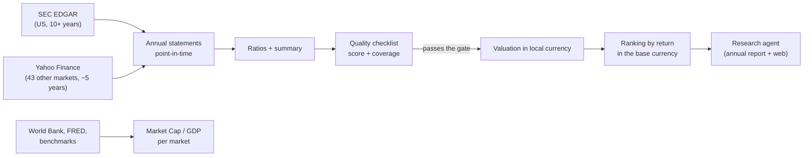

# 01. Overview

## The problem

Tens of thousands of companies are listed around the world. The approach this project follows
says only a small share of them are worth owning: businesses whose advantage is durable enough to
show up as *consistency* in their financial statements, bought at a price that still leaves a good
return. Reading years of annual reports for all of them by hand is not an option.

## What it does

1. **Pull** statements for every listed company above a size floor, in 44 markets.
2. **Rebuild** clean annual statements, as they were known on any date.
3. **Score** each company against the checklist in `knowledge/principles.md`.
4. **Price** the ones that pass: what today's price returns over ten years in local currency, and
   the most you can pay for 15% a year.
5. **Rank** by that return converted to the base currency (PLN by default), so a Turkish 30% and a
   Swiss 10% are compared on equal terms.
6. **Research** the shortlist with a deep agent that reads the annual report and the web.
7. **Read the market**: Market Cap / GDP for each of the 44 markets against its own trend.

## What it deliberately doesn't do

- **Pick on price alone.** A cheap bad business stays below the gate.
- **Let a language model compute numbers.** Every figure is computed in code; the agents read
  and explain, and get the numbers from a tool.
- **Trade.** It tells you what to look at and what to pay. You decide.

## Stages

| Stage | Status |
|---|---|
| US data (EDGAR), checklist, valuation, ranking, CLI | done |
| Dashboard: ranking, company pages, markets | done |
| Every other market (Yahoo Finance), currencies, ranking in PLN | done |
| Market Cap / GDP for every market | done |
| Research agents per company | done |
| Deeper official history outside the US (ESEF, EDINET, DART) | planned |
| Portfolio: positions, ROI/XIRR in PLN, sizing by independence | planned |
| Backtest of the quantitative engine | parked |

Next: **[02 Tech stack](02-tech-stack.md)**.
