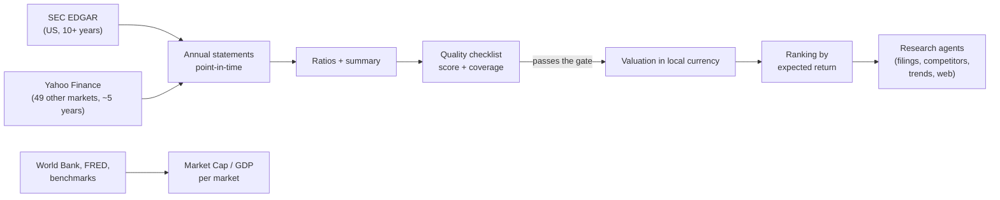

# 01. Overview

## The problem

Tens of thousands of companies are listed around the world. The approach this project follows
says only a small share of them are worth owning: businesses whose advantage is durable enough to
show up as *consistency* in their financial statements, bought at a price that still leaves a good
return. Reading years of annual reports for all of them by hand is not an option.

## What it does

1. **Pull** statements for every listed company above a size floor, in 50 markets.
2. **Rebuild** clean annual statements, as they were known on any date.
3. **Score** each company against the checklist in `knowledge/principles.md`.
4. **Price** the ones that pass: what today's price returns over ten years, in the currency the
   shares trade in, and the most you can pay for 15% a year.
5. **Rank** by that return. Returns stay in each listing's own currency: that's what you'd pay
   and be paid in. Keep in mind that 30% in lira and 10% in francs aren't the same thing.
6. **Check the rest**: the last quarters against a year earlier, the closest peers in the same
   industry from any market, insider buying and selling (US), and the other schools' yardsticks.
7. **Research** the shortlist with four deep agents (filings, competitors, demand trends, web)
   and ask them questions about any company.
8. **Read the market**: Market Cap / GDP for every market the World Bank has history for,
   each against its own trend.

## What it deliberately doesn't do

- **Pick on price alone.** A cheap bad business stays below the gate.
- **Let a language model compute numbers.** Every figure is computed in code; the agents read
  and explain, and get the numbers from a tool.
- **Trade.** It tells you what to look at and what to pay. You decide.

## Stages

| Stage | Status |
|---|---|
| US data (EDGAR), checklist, valuation, ranking, CLI | done |
| Dashboard: ranking, company pages, markets | done |
| Every other market (Yahoo Finance), quote currencies and subunits | done |
| Market Cap / GDP for every market | done |
| Research agents per company, questions, resumable runs | done |
| Quarters, competitors compared on 19 measures, insiders, other lenses (DDM, Monte Carlo and more) | done |
| Deeper official history outside the US (ESEF, EDINET, DART) | planned |
| Scheduled runs and alerts | planned |
| Backtest of the quantitative engine | parked |

Next: **[02 Tech stack](02-tech-stack.md)**.
