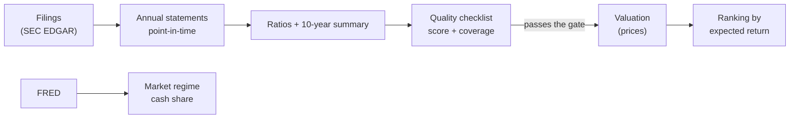

# 01. Overview

## The problem

There are some six thousand companies listed in New York alone, and many
more around the world. The approach this project follows says only a small
share of them are worth owning: businesses whose advantage is durable enough
to show up as *consistency* in ten years of financial statements. Reading
ten years of 10-Ks for six thousand companies by hand is not an option.

## What it does

1. **Pull** every annual report's XBRL facts for every listed company.
2. **Rebuild** clean annual statements, as they were known on any date.
3. **Score** each company against the checklist in `knowledge/principles.md`.
4. **Price** the ones that pass: what today's price returns over ten years,
   and the most you can pay for 15% a year.
5. **Rank** by that return, and show the whole-market regime alongside.

## What it deliberately doesn't do

- **Pick on price alone.** A cheap bad business stays below the gate.
- **Let a language model compute numbers.** Every figure is computed in code;
  the agents (next stage) only read filings and the news and explain.
- **Trade.** It tells you what to look at and what to pay. You decide.

## Stages

| Stage | Status |
|---|---|
| Data pipeline (US + foreign filers on EDGAR), checklist, valuation, ranking, CLI | done |
| Dashboard: ranking, company pages, market regime | done |
| Backtest of the quantitative engine (point-in-time) | next |
| More markets: ESEF (EU/UK incl. Warsaw), EDINET (Japan), DART (Korea) | planned |
| Research agents per shortlisted company | planned |
| Portfolio: positions, ROI/XIRR in PLN, sizing by independence | planned |

Next: **[02 — Tech stack](02-tech-stack.md)**.
