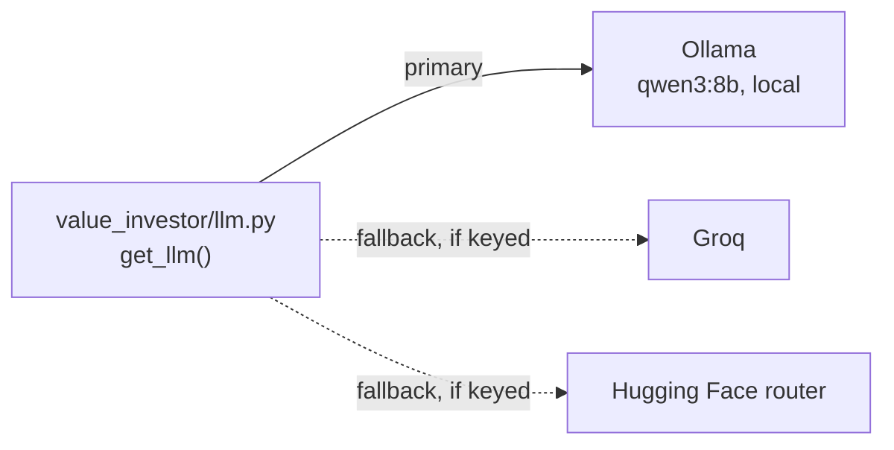

# 02. Tech stack

Everything is free and runs on one laptop.

| Piece | Role | Why this one |
|---|---|---|
| **SEC EDGAR APIs** (`companyfacts`, `submissions`, `company_tickers_exchange`) | Every XBRL fact every listed company filed, ~15 years deep, with filing dates | Official, free, structured — no scraping, no OCR. Needs a contact User-Agent. |
| **yfinance** | Daily prices, dividends, splits | Free. Only used for prices; fundamentals from Yahoo go back just 4 years. |
| **FRED** (CSV endpoint) | 10y / 2y Treasury, GDP, corporate equities, unemployment, VIX | Free, no key for the CSV endpoint. |
| **DuckDB** | One local file holds facts, prices, macro and results | Columnar and fast enough to re-score thousands of companies in minutes; no server. |
| **pandas** | Statement assembly and ratios | |
| **FastAPI + Jinja** | The dashboard | Server-rendered pages, no JS framework, no build step. |
| **Hand-written CSS + SVG charts** (`static/`) | Look and charts | No CDN, no chart library; charts follow one set of rules (thin lines, hairline grid, tooltip, table twin). |
| **LiteLLM Router** + `langchain-litellm` | One `get_llm()` for every model call | Local **Ollama** (Qwen) first; **Groq** and **Hugging Face** as fallbacks when their keys are set. |
| **Rich** | CLI tables | |
| **pytest** | Tests | |

## LLM routing

Set `LLM_PRIMARY=groq` to flip the order when speed matters more than
staying offline. Measured on the reference laptop (Ryzen AI 5 340, CPU only):
qwen3:8b reads ~27 tokens/s and writes ~7 tokens/s, so a long 10-K section
takes minutes. The agents are built for that: short contexts, one question
per call, overnight batches.

Next: **[03 — Data pipeline](03-data-pipeline.md)**.
