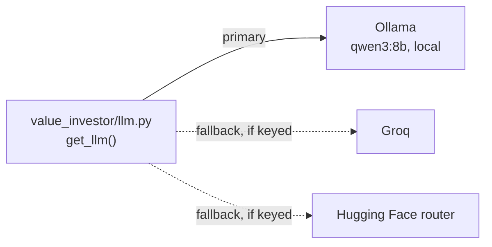

# 02. Tech stack

Everything is free and runs on one laptop.

| Piece | Role | Why this one |
|---|---|---|
| **SEC EDGAR APIs** (`companyfacts`, `submissions`, `company_tickers_exchange`) | Every XBRL fact every US-listed company filed, ~15 years deep, with filing dates | Official, free and structured: no scraping, no OCR. Needs a contact User-Agent. |
| **Yahoo Finance** via `yfinance` | The universe of every other market (screener), their statements (~5 years), all prices, dividends, splits and FX rates | The only free source that covers every exchange the same way. |
| **World Bank API** | Market cap of listed companies / GDP, nominal GDP and inflation for every country | Free, no key, one call per indicator for all countries. |
| **FRED** (CSV endpoint) | US Treasuries, US equities and GDP, VIX, unemployment, OECD 10-year yields for other countries | Free, no key for the CSV endpoint. |
| **DuckDB** | One local file holds facts, prices, macro and results | Fast enough to re-score thousands of companies in minutes; no server. |
| **pandas** | Statement assembly and ratios | |
| **FastAPI + Jinja** | The dashboard | Server-rendered pages, no JS framework, no build step. |
| **Hand-written CSS + SVG charts** (`static/`) | Look, charts, light and dark themes | No CDN, no chart library. |
| **deepagents** (LangChain) | The research agent: planning, subagents, a scratch filesystem | Built for multi-step research with small context windows. |
| **edgartools** | 10-K / 20-F sections as text for the agents | Clean section extraction instead of parsing HTML filings ourselves. |
| **Tavily**, **DuckDuckGo** (`ddgs`) | Web search for the agents | Tavily while its 1,000 free monthly credits last, DuckDuckGo after that. |
| **LiteLLM Router** + `langchain-litellm` | One `get_llm()` for every model call | Local **Ollama** (Qwen) first; **Groq** and **Hugging Face** as fallbacks when their keys are set. |
| **Rich** | CLI tables | |
| **pytest** | Tests | |

## LLM routing

Set `LLM_PRIMARY=groq` to flip the order when speed matters more than staying offline. Measured
on the reference laptop (Ryzen AI 5 340, CPU only): qwen3:8b reads ~27 tokens/s and writes
~7 tokens/s. The first step of a research run, which reads the agent's whole brief, takes about
five minutes; later steps reuse Ollama's prompt cache.

Next: **[03 Data pipeline](03-data-pipeline.md)**.
