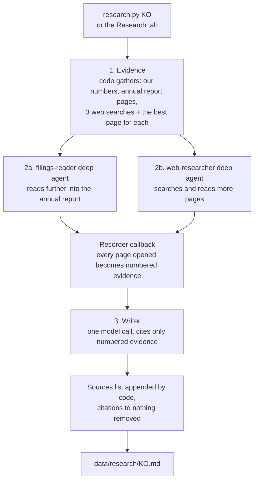

# 07. Research agents

The checklist can tell that a business has had high margins for ten years. It can't tell you
*why*, whether it will last, or why the market is offering it cheaply. That is the agents' job.

## How a run works



### Why it's staged instead of one agent that plans everything

The first version gave a single deep agent the whole job: plan, delegate to two subagents, write.
On the local 8B model it skipped the plan and the subagents, answered from memory after one tool
call, and invented an insider purchase, a wrong dividend yield and three sources it never opened.
A small model can't be trusted to choose to look things up, so the looking-up is now guaranteed:

1. **Evidence first, in code.** Our computed numbers, page 1 of the business and risk-factor
   sections of the annual report (SEC filers), and three web searches (competitors and market
   share, management and insider buying, this year's news), reading the best page for each.
   Companies outside the SEC get an extra search for their latest annual report.
2. **Deep agents dig further.** Two `deepagents` agents, each with its own planning list and
   scratch filesystem: `filings-reader` (US filers) reads deeper into the annual report including
   MD&A; `web-researcher` reads at least three more pages. A LangChain callback records every page
   and report section they open as evidence, so what they read counts even if they summarise badly.
3. **One writer call.** The brief is written from the numbered evidence and the agents' notes only.
   It must cite `[n]` after each claim and quote financial figures from our numbers as given.
4. **Code has the last word on sources.** The model's own sources section is dropped, the real list
   (titles and URLs of everything gathered) is appended, and any `[n]` that points past the list is
   removed. Em and en dashes are replaced.

With a large model (Groq) the same pipeline simply produces better briefs faster.

## Tools (`research_tools.py`)

| Tool | What it returns |
|---|---|
| `company_numbers` | Our analysis as text: profile, every checklist line, valuation, flags. |
| `annual_report_section` | The latest 10-K or 20-F, section by section (`business`, `risk_factors`, `mda`), 5,000 characters per page. For companies outside the SEC it returns the Yahoo business description and points to web search. |
| `web_search` | Tavily while the free monthly credits last (counted in `data/research/tavily_usage.json`), then DuckDuckGo. |
| `read_web_page` | Readable text of an HTML page, 5,000 characters per page. Only public http(s) addresses; local and private network addresses are refused. |

All tools are read-only. The agents cannot run code, write to the database or touch files outside
their scratch space.

## The brief

`prompts.py` holds the principles (the three kinds of advantage, red flags, good signs, why a great
business might be cheap), the subagent briefs and the writer prompt with the exact structure:
verdict, what the business does, competitive advantage (which kind, its source such as brand,
switching costs, network effects, cost or scale, and whether it is widening or narrowing),
competitors, management, why it might be cheap, opportunities, risks, the bull case against the
bear case, and how the story squares with the numbers, including the other lenses.

## Running it

```bash
python research.py KO              # one company
python research.py --top 5         # the top of the ranking
```

or the **Run research** button on a company's Research tab, which starts a background run (one at
a time) and shows progress until the brief appears.

On the local model a brief takes roughly half an hour on a laptop, most of it the model reading
long prompts at ~27 tokens/s. With `GROQ_API_KEY` set and `LLM_PRIMARY=groq` it takes a few minutes.

## Trust

Every claim should carry a source number that leads to a real page or report section. The writer is
told to say plainly when the sources don't cover something rather than fill the gap. Treat the brief
as a well-organised starting point for your own reading, not a verdict.

Next: **[08 Compared with other projects](08-compared.md)**.
