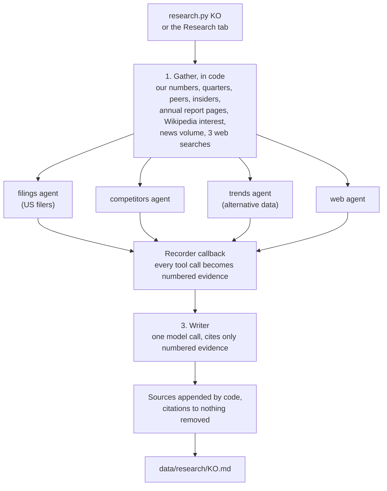

# 07. Research agents

The checklist can tell that a business has had high margins for ten years. It can't tell you
*why*, whether it will last, how the competitors are doing, whether demand is turning, or why the
market is offering it cheaply. That is the agents' job.

## How a run works



### Why it's staged instead of one agent that plans everything

The first version gave a single deep agent the whole job. On the local 8B model it skipped the
plan, answered from memory after one tool call, and invented an insider purchase, a wrong dividend
yield and three sources it never opened. A small model can't be trusted to choose to look things
up, so the looking-up is guaranteed:

1. **Evidence first, in code.** Our computed numbers, the last quarters, the peer table, form 4
   insider trades (US), page 1 of the business and risk sections of the annual report (SEC filers),
   Wikipedia pageviews for the company, GDELT news volume and tone, and three web searches with
   the best page for each.
2. **Four deep agents dig further**, each with its own planning list and scratch space:
   - `filings` (US filers) reads deeper into the annual report, including MD&A;
   - `competitors` starts from the peer table, names the main competitors and looks each one up:
     share, pricing, products, customers won or lost;
   - `trends` looks for demand turning before the filings show it: quarters, Wikipedia interest
     in the company and its main brands, news volume and tone, insider trades, and the web for
     reviews, app rankings, hiring, store openings and industry data, against one competitor;
   - `web` covers management, news, controversies, lawsuits and why the price moved.
   A LangChain callback records every tool call as evidence, so what they read counts even if
   they summarise badly.
3. **One writer call.** The brief is written from the numbered evidence and the agents' notes only,
   trimmed to fit a 16k context. It must cite `[n]` after each claim and quote our figures as given.
4. **Code has the last word on sources.** The model's sources section is dropped, the real list is
   appended, citations past the list are removed, and names not found in the cited source are
   marked. Em and en dashes are replaced.

### Runs that stop halfway

After each stage the evidence and notes so far are saved to `data/research/<TICKER>.partial.json`.
If a run dies (the laptop sleeps, the server restarts), the next run of the same ticker picks up
after the last finished stage, for up to seven days. The Research tab offers **Resume** or
**Start over**.

## Questions

The Research tab has an **Ask** box. A question goes to one deep agent with every tool below,
which looks things up and leaves notes; a writer call then answers in a few paragraphs from the
numbered evidence, and only the sources it cites are listed. Answers are kept in
`data/research/<TICKER>.qa.json`.

## Tools (`research_tools.py`)

| Tool | What it returns |
|---|---|
| `company_numbers` | Our analysis as text: profile, every checklist line, valuation, lenses, quarters, insiders, flags. |
| `quarterly_results` | The last eight quarters: revenue, margins, net income, each against a year earlier, and the trend. |
| `peer_table` | The closest companies in the same industry, from any market, with the same computed numbers. |
| `insider_trades` | Form 4 open-market buys and sells over the last year, planned 10b5-1 sales marked (US only). |
| `annual_report_section` | The latest 10-K or 20-F by section (`business`, `risk_factors`, `mda`), 5,000 characters per page. For companies outside the SEC it returns the Yahoo description and points to web search. |
| `attention_trend` | Monthly English Wikipedia pageviews for a company, brand or product, last 12 months against the 12 before. Free, no key. |
| `news_trend` | GDELT news volume and tone over the last 12 months. Free, no key, one request every five seconds. |
| `web_search` | Tavily while the free monthly credits last, then DuckDuckGo. |
| `read_web_page` | Readable text of an HTML page, 5,000 characters per page. Public addresses only. |

All tools are read-only. The agents cannot run code, write to the database or touch files outside
their scratch space.

## The brief

`prompts.py` holds the principles, the agents' briefs and the writer prompt with its structure:
verdict, what the business does, competitive advantage (kind, source, widening or narrowing),
competitors and market position with the peer numbers, recent quarters, demand and attention,
management and ownership with insider trades, why it might be cheap, opportunities, risks, the
bull case against the bear case, and how the story squares with the numbers and the other lenses.

## Running it

```bash
python research.py KO              # one company (resumes an unfinished run)
python research.py --top 5         # the top of the ranking
```

or the buttons on a company's Research tab (one brief at a time, progress shown until it's done).

On the local model a brief takes the better part of an hour on a laptop, most of it the model
reading long prompts. With `GROQ_API_KEY` set and `LLM_PRIMARY=groq` it takes minutes.

## Trust

Every claim should carry a source number that leads to a real page, report section or table. The
writer is told to say plainly when the sources don't cover something. Alternative data is weak
evidence on its own: a Wikipedia spike can be a scandal, a news surge can be a lawsuit. Treat the
brief as a well-organised starting point for your own reading, not a verdict.

Next: **[08 Compared with other projects](08-compared.md)**.
